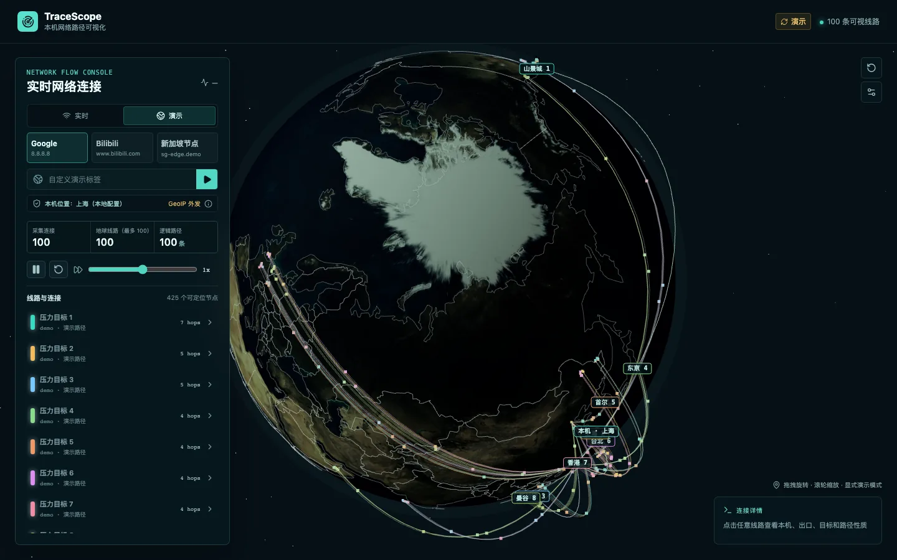

# TraceScope

TraceScope 是一个本机实时网络连接的 3D 地球可视化原型，用于验证未来接入 Deepseek Harness 的产品与技术边界。它会把当前公网目标显示为独立线路，并在线路上播放信号动画；不会把代理链伪装成真实逐跳路径。



_100 条合成线路的脱敏压力场景；实时模式只显示本机当前可用的公网目标。_

## 本地运行

需要 Node.js 20+ 和 macOS 自带的 `lsof`、`traceroute`。

```bash
npm install
npm run dev
```

- 页面：<http://127.0.0.1:4173>
- 本机 API：<http://127.0.0.1:8788/health>
- WebSocket：`ws://127.0.0.1:8788/ws`

`npm run dev` 会同时启动前端和本机服务，两者都只监听 `127.0.0.1`。页面默认连接实时源；后端不可用时，页面会显示重连/离线状态，可以手动切换到明确标注的演示模式。

地球最多显示 `100` 个真实唯一公网目标。可用 `TRACESCOPE_MAX_ROUTES` 覆盖为 `1..200` 的整数；非法值回落到 `100`。实际目标不足上限时只显示当前可用目标，不补演示数据。

### 本机物理位置

本机物理位置是本地配置，不从公网出口 IP 推断。默认值按当前使用者设置为北京：`39.9042, 116.4074`。可以创建 `~/.config/tracescope/config.yaml` 覆盖：

```yaml
physicalOrigin:
  latitude: 39.9042
  longitude: 116.4074
  city: 北京
  country: 中国
```

也可以同时设置 `TRACESCOPE_ORIGIN_LATITUDE`、`TRACESCOPE_ORIGIN_LONGITUDE`、`TRACESCOPE_ORIGIN_CITY`、`TRACESCOPE_ORIGIN_COUNTRY`。四项必须完整有效，环境变量优先于配置文件；`TRACESCOPE_CONFIG` 可以指定其他本地 YAML 路径。这些坐标只在本机读取，不会发送给 GeoIP 服务。

## 数据链路

1. 服务端从本机 Mihomo controller 的 `/connections` 读取连接，自动从本机活动配置读取认证信息。controller 不可用时降级到 `lsof -nP -iTCP -sTCP:ESTABLISHED`。
2. 连接按稳定目标身份聚合，过滤 loopback、link-local、内网、`198.18.0.0/15` Fake-IP 和本应用连接。地球默认最多显示按活动度与流量排序的 100 个公网目标。
3. Mihomo chain 中任一精确 `DIRECT` 项判定为直连；含明确 VPN、corp/internal、企业或内网特征的 chain 判定为 VPN；其他 selector/node chain 判定为普通代理。产品或服务名称本身不作为 VPN 证据，三类连接不会聚合到同一条线路。
4. 域名在需要时通过 Cloudflare DoH 解析；目标、可用 traceroute hop 与代理/VPN 公网出口候选通过 ipwho.is 获取地理位置。查询均有超时、缓存、限流，失败不会中断实时 feed。
5. 只有直连公网目标才会进入受控 traceroute 队列：并发上限 2，单跳等待 1 秒，最多 12 hops。代理与 VPN 线路分别显示“本机物理位置 → 代理/VPN 公网出口 → 逻辑目标”，并展示原始 chain；它们不声称是逐跳 traceroute。
6. 后端通过 v2 WebSocket schema 推送 `status`、`snapshot`、`update`、`error`。每条路线显式区分 `physicalOrigin`、`proxyEgress`/`vpnEgress` 与 `destination`。客户端断线后指数退避重连；暂停按钮只暂停信号动画，不停止采集。

## 地球边界数据

国家与海岸边界来自 `world-atlas@2.0.2` 发布包的 `countries-110m.json`，原始数据为 Natural Earth 1:110m。Natural Earth 数据为 public domain，`world-atlas` 转换代码采用 ISC 许可。资产已打包到 `public/countries-110m.json`，运行时不依赖远程 CDN。前端用 `topojson-client` 展开真实 Polygon/MultiPolygon，并在跨日期变更线处断开后投影到球面；边界仅用于地理参照，不显示国家文字标签。

## 隐私边界

- Mihomo secret 只由 Node 服务从本机 YAML 配置读取，保留在服务端内存中；不会进入前端、WebSocket payload、日志、文档或测试 fixture。
- WebSocket 不发送本地源 IP，服务端默认不打印连接快照或目标明细。
- 本机服务只接受本地开发页面的 Origin，并只绑定回环地址；不会修改 Mihomo/Clash 配置。
- GeoIP 定位会把公网目标 IP、代理/VPN 公网出口发送给 `ipwho.is`。本机物理位置不外发。当 Fake-IP 目标需要真实解析时，目标域名会发送给 Cloudflare DoH。界面会持续显示这个边界。

## 路径语义

- `trace / direct / complete`：北京 → 可定位的真实 traceroute 公网 hops → 目标。
- `logical-direct / direct / pending|unavailable`：直连 traceroute 正在排队或没有返回可定位 hop；绘制北京 → 目标。
- `logical-proxy / proxy / not-applicable`：北京 → 代理公网出口候选 → 目标；整条路线是逻辑代理路径，不是逐跳 traceroute。
- `logical-vpn / vpn / not-applicable`：北京 → VPN 公网出口候选 → 目标；与普通代理分开标记。

城市与运营商来自第三方 GeoIP 数据库，可能存在误差；弧线表示地理点之间的可视连接，不代表海缆或物理光纤的精确走向。

## 验证

```bash
npm test
npm run lint
npm run build
node scripts/visual-smoke.mjs
```

单元测试覆盖 Mihomo 与 lsof 解析、Fake-IP/私网过滤、目标去重、最大路线配置、macOS traceroute 解析和 WebSocket schema。视觉 smoke 覆盖桌面、800×600、移动端实时状态、非空 Canvas、线路数量、右下 overlay 不相交、拖拽后无相机回拉以及浏览器错误；`?stress=100` 是明确的本地演示压力入口，不会混入实时 feed。
